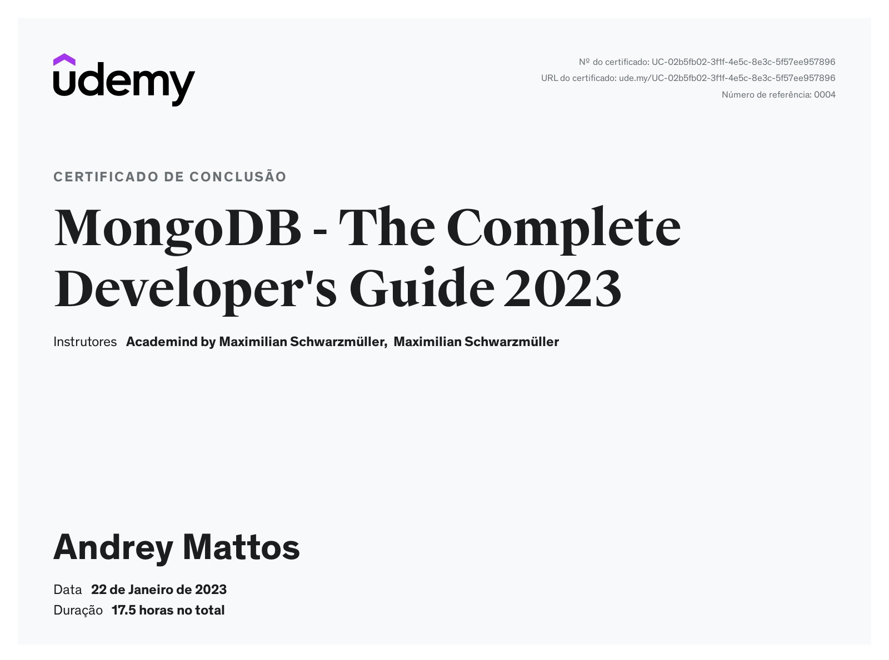

# MongoDB

### Resumo do curso [MongoDB](https://www.udemy.com/course/mongodb-the-complete-developers-guide/)
- Resumo feito em inglês para treino, não sou fluente ainda, então espere encontrar vários erros.

### Duração: 17,5 horas

### Conteúdo
- Introdução
- CRUD Básico
- Esquemas e relacionamentos
- Como estruturar Documentos.
- Explorando o SHELL (**mongosh**)
- Entendendo a fundo CRUD:
- Operações de criação (insertOne, insertMany)
- Operações de leitura (find, findOne)
- Operações de atualização (updateOne, updateMany)
- Operações de apagar (deleteOne, deleteMany)
- Trabalhando com Indexes
- Trabalhando com Geolocalizalçao
- Trabalhando com Números
- Segurança
- Transações
- Do shell para o Driver (exemplo em NodeJS)

### Certificado

### What is MongoDB?

MongoDB is a document-oriented NoSQL database used for high volume data store.

Instead of using tables and rows as in the traditional relational databases, MongoDB makes use of collections and documents.

- Documents consist of key-value pairs which are basic unit of data in MongoDB.
- Collections contain sets of document and function which if equivalent of relation database tables.

- The MongoDB database contains collections just like the MYSQL database contains tables. You are allowed to create multiple databases and multiple collections.
- Now inside of the collection we have documents. These documents contain the data we want to store in the MongoDB database and a single collection can contain multiple documents and you are **schema-less** means it is not necessary that one document is similar to another.
- The documents are created using the fields. Fields are key-value pairs in the documents, it is just like columns in the relation database. The value of the fields can be of any BSON data types like double, string, boolean, etc.
- The data stored in the MongoDB is in the format BSON documents. Here, BSON stands for Binary representation of JSON documents.
- In MongoDB documents, you are allowed to store nested data.

[Basic && CRUD](MongoDB%20f82bbae55fc744928e95f0b23756aac1/Basic%20&&%20CRUD%20321f255599164b479eaa42a9bfc36218.md)

[Query](MongoDB%20f82bbae55fc744928e95f0b23756aac1/Query%20af518961a5604889af400f25b93994b8.md)

[Aggregation](MongoDB%20f82bbae55fc744928e95f0b23756aac1/Aggregation%207ad0ba83391740aca92f7c6f79e06bcd.md)

[Operators](MongoDB%20f82bbae55fc744928e95f0b23756aac1/Operators%20776160060ebd44b1a8441528046d4b03.md)

[Indexes](MongoDB%20f82bbae55fc744928e95f0b23756aac1/Indexes%20717fd97228a54bebb44cd4d36412a35d.md)

[Security](MongoDB%20f82bbae55fc744928e95f0b23756aac1/Security%203b6dba898e4940778c87a1d08e9b21ee.md)